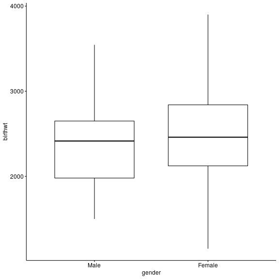
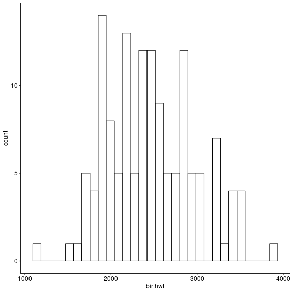

How to make plots in R using ggpubr
========================================================
author: Michail Belias  
date: 06-12-2018
autosize: true
class: small-code


Introduction
========================================================

The ggpubr is a R package that helps you create basic beautiful ggplot2-based graphs.

What is ggpubr:
- Wrapper around the ggplot2 package for beginners in R programming.
- Helps researchers, with basic R programming skills, to create easily publication-ready plots.
- Gives the possibility to add p-values and significance levels to plots.
- Makes it easy to arrange and annotate multiple plots on the same page.
- Makes it easy to change grahical parameters such as colors and labels.
- Is still a ggplot2 object... 
  - Therefore, it can be further manipulated as a ggplot object

Generate some data for descriptive statistics
========================================================


```r
Sigma= matrix(c(20,15,15,20), 2)
Sigma2= matrix(c(15,10,10,15), 2)


df =  data.frame(mvrnorm(1000,c(180,80) , Sigma = Sigma) , Gender = rep("Male"))
df2 =  data.frame(mvrnorm(400,c(170,65) , Sigma = Sigma2) , Gender = rep("Female"))

df = rbind(df, df2)
names(df) = c("Height","Weight","Gender")
```

1. Distribution plots
========================================================

Under this section we consider 

- Box Plots
- Violin + Boxplot
- Dot + Box Plot
- Histograms
- Density Plots


Βοx-plot code 
========================================================


```r
gg<- ggboxplot(df ,
            x = "Gender", 
            y = "Weight", # variable to be plotted
            color = "black", # paint the borders by Gender
            fill = "Gender", # fill the boxes with color
            title = "Box-plot of weight colored by gender", # a better title
            palette = "jco", # use the jco palette
            add = "mean", # or median
            bxp.errorbar = T  # adds the error bars of boxplots 
            ) +   
  theme(plot.title = element_text(hjust = 0.5))
```

Βοx-plot 
========================================================


violin-plot with boxplot code 
========================================================


```r
gg <-ggviolin(df ,
            x = "Gender", 
            y = "Weight", # variable to be plotted
          combine = TRUE, title="Violin-plot with boxplot",
          color = "Gender", palette = "jco",
          ylab = "Expression", 
          add = "boxplot")+   
  theme(plot.title = element_text(hjust = 0.5))
```

Βοxplot with violin 
========================================================


Dotplot code 
========================================================


```r
gg<- ggdotplot(df ,
            x = "Gender", 
            y = "Weight", # variable to be plotted
            combine = TRUE, 
            color = "Gender", 
            palette = "jco",
            fill = "white",
            binwidth = 0.1,
            ylab = "Expression", 
            add = "median_iqr",
            add.params = list(size = 0.9)
          )
```

Dotplot
========================================================


Histogram code 
========================================================


```r
gg<- gghistogram(df, 
            x= "Weight" ,   # variable to be plotted
            y= "..count..", # or "..density.."
            color = "Gender", # paint the borders by Gender
            fill = "Gender", # fill the bars with color
            bins = 25 , # control how many bars will the histogram have
            title = "Histogram of weight colored by gender", # a better title
            palette = "jco", # use the jco palette
            add = "mean", 
            add_density = T,
            ) +   theme(plot.title = element_text(hjust = 0.5))
```

Histogram plot 
========================================================


Density plot code
========================================================


```r
gg <-  ggdensity(df, 
          x = "Weight",
          fill = "Gender",
          palette = "jco", 
          adjust = 3,
          title = "Density plot of weight", 
          linetype = "dotdash",color = "Gender",
          facet.by = "Gender",add = "mean" ) +   
  theme(plot.title = element_text(hjust = 0.5))
```

Density plot 
========================================================


```r
plot(gg)
```




2.Correlation plots 
========================================================

Under this section we consider 

- Scatterplots
- Jitter Plots
- Counts Chart
- Bubble Plot
- Marginal Histograms / Boxplot


Scatterplots-Bubble plot code
========================================================

```r
gapminder = gapminder
# Scatterplot
names(gapminder) =  c("Country","Continent","Year","Life_Expectancy",
                      "Population","GDP_per_capita_percentage")

gg = gapminder%>%
    filter(Year %in% "2007")%>%
ggplot( aes(GDP_per_capita_percentage, Life_Expectancy,size = Population, 
            color = Continent)) + # This is then main plot 
  ggtitle("Life expectancy association with GDP per capita percentage (in 2007)")+
  # a new title
  theme(plot.title = element_text(hjust = 0.5))+
    geom_point() + # insert the points of the parameters used in the general ggplot
  theme(plot.title = element_text(hjust = 0.5)) + 
  xlab("GDP per capita") + # Change the label of X-axis
  ylab("Life Expectancy")+ # Change the label of Y-axis
  scale_x_log10() # log-Scale X values 
```

Scatterplots-Bubble plot 
========================================================


 
 
Scatterplot code
========================================================


```r
# Scatterplot


g = ggscatter(df , x = "Weight",y = "Height", 
              color = "Gender", palette = "jco",
              title = "Association of weight and height in males and females",
              xlab = "Weight measured in kilograms",
              ylab = "Height measured in centimeters", 
              shape = 1,
              ggtheme = theme_bw(),
              ellipse = T, 
              ellipse.alpha = 0.4,
              fill = "white"
              )
```

Scatterplot with ellipsis plot
======================================================== 




Scatterplot with marginal histogram plot
======================================================== 


```r
ggMarginal(g, type = "histogram", fill="transparent")
```


Error plots
======================================================== 


```
   len supp dose
1  4.2   VC  0.5
2 11.5   VC  0.5
3  7.3   VC  0.5
4  5.8   VC  0.5
5  6.4   VC  0.5
6 10.0   VC  0.5
```


```r
# Change error plot type and add mean points
ggerrorplot(ToothGrowth, x = "dose", y = "len", 
            desc_stat = "mean_sd",
            error.plot = "errorbar",            # Change error plot type
            add = "mean"                        # Add mean points
            )
```


