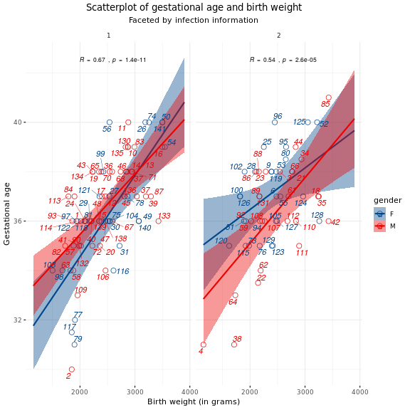
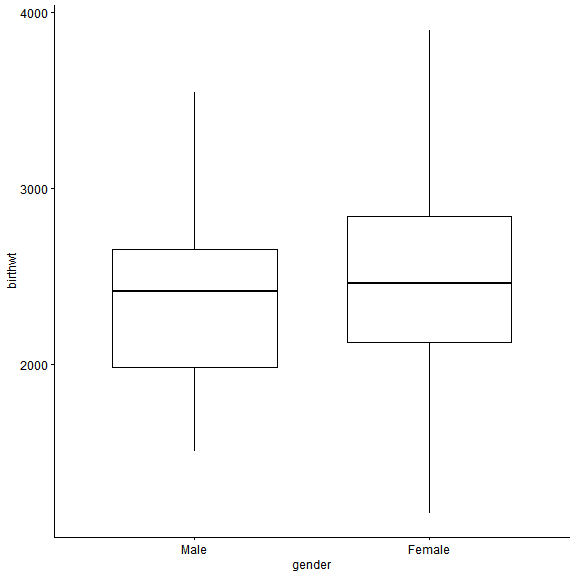
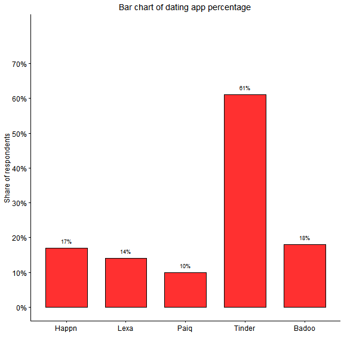
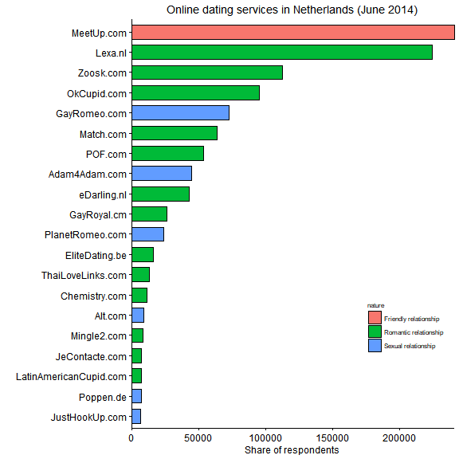

How to make plots in R using ggpubr
========================================================
author: Michail Belias  
date: 06-12-2018
autosize: true
class: small-code
width: 1980
height: 1200
autosize: true


Install and load the packages we will use
========================================================

- You can do it manually through the "install" dialog in the "packages" tab 


```r
if(!require(haven)) install.packages("haven")
if(!require(dplyr)) install.packages("dplyr")
if(!require(ggpubr))library(ggpubr)
if(!require(ggplot2)) install.packages("ggplot2")
if(!require(readxl))library(readxl)
if(!require(gapminder)) install.packages("gapminder")
if(!require(ggExtra)) install.packages("ggExtra")
if(!require(ggsci))library(ggsci)
```


Introduction
========================================================

The ggpubr is a R package that helps you create basic beautiful ggplot2-based graphs.

What is ggpubr:

 * Wrapper around the ggplot2 package for beginners in R programming.
 * Helps researchers, with basic R programming skills, to create easily publication-ready plots.
 * Gives the possibility to add p-values and significance levels to plots.
 * Makes it easy to arrange and annotate multiple plots on the same page.
 * Makes it easy to change grahical parameters such as colors and labels.
 * Is still a ggplot2 object... 
   * Therefore, it can be further manipulated as a ggplot object

First we load the data
========================================================

- We can either use the command line or load them manually
- Use the "Import Dataset" dialog in the Enviroment Tab


```r
bladder   <- read_sav("Data/bladder.sav")
surgery   <- read_sav("Data/surgery.sav")
skullrats <- read_sav("Data/SkullRats.sav")
```


Know your data
========================================================

- Feel free to use your own data in our lab
- with the following commands we can get in touch with our data
  * summary("dataname"), names("dataname"), head("dataname") 
- Use the help tab in your right to see what the functions do (and their options)
- Please play around with the data

Know your data (part2)
========================================================

```r
names(bladder)
```

```
 [1] "Id"        "Birthday"  "gender"    "Date_diag" "Stage"    
 [6] "Grade"     "solitaire" "Nareas"    "Biopsy"    "Therapy"  
[11] "Recidive"  "Died"      "date_rec"  "date_ovl" 
```

```r
names(surgery)
```

```
[1] "id"       "gender"   "place"    "birthwt"  "gestatio" "lengthst"
[7] "infect"   "prematur" "surgery" 
```

```r
names(skullrats)
```

```
[1] "obs"      "treat"    "rat"      "age"      "response" "t"       
```


Distribution plots
========================================================

Under this section we will show how to plot 

 * Boxplots...........(with ggboxplot) 
 * Histograms.........(with gghistogram)
 * Density Plots......(with ggdensity)

For every function above there is a full description in their help file.
Go to the tab "Help" and write the function in the search box

Boxplot code 
========================================================

First we will see a simple box-plot


```r
gg<- ggboxplot(surgery ,  # the data-set
            x = "gender", # the x-values is the categorical variable
            y = "birthwt" # the y-values is their values 
            )
```

Boxplot
========================================================



Full boxplot code 
========================================================

- Search the help file of ggboxplot
- *Tip:* If you select any function and press F1 you go to the function's help file right away


```r
ggboxplot(data, x, y, # load the data and choose the x and y variables
  combine = FALSE, merge = FALSE, color = "black", 
  fill = "white", palette = NULL, title = NULL, xlab = NULL,
  ylab = NULL, bxp.errorbar = FALSE, bxp.errorbar.width = 0.4,
  facet.by = NULL, panel.labs = NULL, short.panel.labs = TRUE,
  linetype = "solid", size = NULL, width = 0.7, notch = FALSE,
  select = NULL, remove = NULL, order = NULL, add = "none",
  add.params = list(), error.plot = "pointrange", label = NULL,
  font.label = list(size = 11, color = "black"), label.select = NULL,
  repel = FALSE, label.rectangle = FALSE, ggtheme = theme_pubr())
```

Full boxplot code 
========================================================


```r
gg <- ggboxplot(data = surgery,x =  "gender", y = "birthwt",
          xlab = "Gender", ylab = "Birth Weight (in grams)",
          width = 0.5,add = "jitter", 
          shape = "gender",fill = "gender",palette = "simpsons",
          title = "A boxplot of weight at the time of birth",
          legend = "bottom",legend.title="Gender",font.legend = c(10, "bold", "darkgrey"),  
          font.main = c(18, "italic", "black"),
          subtitle = "Male and female infants compared ", font.subtitle = c(12, "bold.italic", "darkgreen"),
          ggtheme = theme_minimal()
) +   
  theme(plot.title = element_text(hjust = 0.5),
        plot.subtitle = element_text(hjust = 0.5)) + 
  stat_compare_means(method = "wilcox.test")#  Add a p-value
```

Boxplot
========================================================


Simple histogram code 
========================================================


```r
# Basic histogram plot
gghistogram(surgery, x = "birthwt")
```


Histogram code 
========================================================


```r
gg<- gghistogram(surgery, x = "birthwt",y = "..density..",add = "median",
            bins = 10 , # how many bars will the histogram have
            xlab = "Weight at birth (in grams)", ylab = "Density",
            title = "Histogram of infant weight at birth",
            fill = "gender",color = "grey",palette = "lancet",
            alpha = 0.2,legend = "bottom",legend.title="Gender",
            font.legend = c(10, "bold", "darkgrey"), facet.by = "infect", ggtheme = theme_minimal(), add_density = T )+   
  theme(plot.title = element_text(hjust = 0.5),
        plot.subtitle = element_text(hjust = 0.5))
```

Histogram plot 
========================================================



Simple Density plot code 
========================================================

```r
# Basic Density plot 
ggdensity(surgery, x = "birthwt")
```


Density plot code
========================================================


```r
gg <-  ggdensity(surgery, x = "birthwt",add = "median",
            xlab = "Weight at birth (in grams)", ylab = "Frequency",
            title = "Density plot of infant weight at birth",
            fill = "gender",color = "grey",palette = "lancet",
            alpha = 0.2,legend = "bottom",legend.title="Gender",
            font.legend = c(10, "bold", "darkgrey"), facet.by = "infect", ggtheme = theme_minimal() )+   
  theme(plot.title = element_text(hjust = 0.5),
        plot.subtitle = element_text(hjust = 0.5))
```

Density plot 
========================================================


```r
plot(gg)
```


Scatterplots
========================================================

What we learned so far?

1) We use the help file of the gg"function"
2) All the gg functions we:
  - compatible with ggpar() function options
  - produced ggplot2 objects
  - which we can further manipulate using ggplot2 functions
    - theme() , facet_grid() etc are really useful

Scatterplots-Bubble plot code
========================================================

```r
gapminder = gapminder
# Scatterplot
names(gapminder) =  c("Country","Continent","Year","Life_Expectancy","Population","GDP_per_capita_percentage")

gg = gapminder%>%
    filter(Year %in% "2007")%>%
ggscatter( x = "GDP_per_capita_percentage", y = "Life_Expectancy",
           size = "Population", 
            color = "Continent", 
           title = "Life expectancy association with GDP per capita percentage (in 2007)",
           xlab = ,ylab = "Life Expectancy",
           legend.position = "right") + 
  theme(plot.title = element_text(hjust = 0.5))
```

Scatterplots Bubble plot 
========================================================


Scatter-plot code
========================================================

Can we make this plot?


Simple point-line plots
======================================================== 


Spaggetti plots
======================================================== 


```r
ggplot(data=skullrats,aes(x=age,y=response,color=as.factor(rat)))+
  geom_point()+geom_line()+facet_wrap(~treat)+
  theme(legend.title = element_text(size=8),legend.text=element_text(size=7))+
  ylab("Mean Response in pixels")+scale_y_continuous(limits=c(65,92.5),breaks=seq(65,92.5,5),expand=c(0,0))+
  xlab("Age in days")+scale_x_continuous(limits=c(50,110),breaks=seq(50,110,10))+
  scale_color_discrete(name="Rat")+ggtitle("Treatment")+theme(plot.title = element_text(hjust=0.5,size = 10))
```


Bar plots code
========================================================


```r
gg= ggbarplot(data = data1, #import  Data
          x="App",          # The X-value
          y="Proportion",   # The percentages
          fill="firebrick1",# The color of the bars
          xlab = "",        # label of X-axis
          title = "Bar chart of dating app percentage", # better title
          ylim = c(0,0.80), # Increase the ylimits
          ylab = "Share of respondents",
          order = c("Happn","Lexa","Paiq","Tinder","Badoo"))+   
  theme(plot.title = element_text(hjust = 0.5))+ 
  scale_y_continuous(breaks=seq(0,0.7,0.1),
                     labels=scales::percent)+
  geom_text(aes(label=paste(Proportion*100,"%",sep = "")),size=3,vjust=-1)
```

Bar Chart
========================================================


Ordered bar chart code
========================================================


```r
gg= data2%>%
  arrange(desc(-freq))%>%
  ggbarplot( #import  Data
          x="website",          # The X-value
          y="freq",   # The percentages
          fill="nature",# The color of the bars
          xlab = "",        # label of X-axis
          title = "Online dating services in Netherlands (June 2014)", # better title
          ylim = c(0,300000), # Increase the ylimits
          ylab = "Share of respondents")+ rotate() +
  scale_y_continuous(breaks=seq(0,300000,50000),expand=c(0,0))+
    theme(legend.position =c(0.85,0.25),
          legend.title=element_text(size=8),
          legend.text=element_text(size=8),
          plot.title = element_text(hjust = 0.5))
```

Ordered bar chart 
========================================================

```r
plot(gg)
```



Lollipop Chart code
========================================================


```r
# Plot
gg= ggplot(data2,aes(x=reorder(website,freq), 
                     y=freq, color=nature, 
                     fill = nature)) + 
  geom_point(size=5,shape = 1) + 
  geom_segment(aes(x=website, xend=website, y=0, yend=freq)) + 
  labs(title="Lollipop Chart", 
       subtitle="Online dating services in Netherlands (June 2014)", 
       caption="source: Alexa.com") + scale_color_lancet()+
  theme(axis.text.x = element_text(angle=65, vjust=0.6))+
  geom_text(aes(label= freq),size=2,hjust=-0.35) + rotate()
```


```r
plot(gg)
```


Line-point plots code
========================================================


```r
data4 <- read_excel("Data/Data for graphs.xlsx", sheet = "Sheet3")

## Exercise: Now code your plot to look like this:
gg <- ggplot(data=data4,aes(x=year,y=proportion,color=how))+
  geom_point()+geom_line()+theme_minimal()+xlab("Year Couple Met")+ylab("percentage who met this way")+
  scale_y_continuous(limits=c(0,0.7),breaks=seq(0,0.7,0.1),labels=scales::percent,expand=c(0,0))+
  scale_x_continuous(limits=c(1990,2014),breaks=seq(1990,2014,10),expand=c(0,0))+
  theme(legend.position = c(0.2,0.8))+geom_point(aes(shape=how))+scale_shape(guide=FALSE)+
  scale_color_discrete(name="",breaks=c("Met Online","Met through Friends","Bar/Restaurant"))+facet_wrap(~orientation)
```

Line-point plots
========================================================


```r
plot(gg)
```




```

  |                                                                       
  |                                                                 |   0%
  |                                                                       
  |.                                                                |   2%
  |                                                                       
  |..                                                               |   3%
  |                                                                       
  |...                                                              |   5%
  |                                                                       
  |....                                                             |   6%
  |                                                                       
  |.....                                                            |   8%
  |                                                                       
  |......                                                           |   9%
  |                                                                       
  |.......                                                          |  11%
  |                                                                       
  |........                                                         |  12%
  |                                                                       
  |.........                                                        |  14%
  |                                                                       
  |..........                                                       |  15%
  |                                                                       
  |...........                                                      |  17%
  |                                                                       
  |............                                                     |  18%
  |                                                                       
  |.............                                                    |  20%
  |                                                                       
  |..............                                                   |  22%
  |                                                                       
  |...............                                                  |  23%
  |                                                                       
  |................                                                 |  25%
  |                                                                       
  |.................                                                |  26%
  |                                                                       
  |..................                                               |  28%
  |                                                                       
  |...................                                              |  29%
  |                                                                       
  |....................                                             |  31%
  |                                                                       
  |.....................                                            |  32%
  |                                                                       
  |......................                                           |  34%
  |                                                                       
  |.......................                                          |  35%
  |                                                                       
  |........................                                         |  37%
  |                                                                       
  |.........................                                        |  38%
  |                                                                       
  |..........................                                       |  40%
  |                                                                       
  |...........................                                      |  42%
  |                                                                       
  |............................                                     |  43%
  |                                                                       
  |.............................                                    |  45%
  |                                                                       
  |..............................                                   |  46%
  |                                                                       
  |...............................                                  |  48%
  |                                                                       
  |................................                                 |  49%
  |                                                                       
  |.................................                                |  51%
  |                                                                       
  |..................................                               |  52%
  |                                                                       
  |...................................                              |  54%
  |                                                                       
  |....................................                             |  55%
  |                                                                       
  |.....................................                            |  57%
  |                                                                       
  |......................................                           |  58%
  |                                                                       
  |.......................................                          |  60%
  |                                                                       
  |........................................                         |  62%
  |                                                                       
  |.........................................                        |  63%
  |                                                                       
  |..........................................                       |  65%
  |                                                                       
  |...........................................                      |  66%
  |                                                                       
  |............................................                     |  68%
  |                                                                       
  |.............................................                    |  69%
  |                                                                       
  |..............................................                   |  71%
  |                                                                       
  |...............................................                  |  72%
  |                                                                       
  |................................................                 |  74%
  |                                                                       
  |.................................................                |  75%
  |                                                                       
  |..................................................               |  77%
  |                                                                       
  |...................................................              |  78%
  |                                                                       
  |....................................................             |  80%
  |                                                                       
  |.....................................................            |  82%
  |                                                                       
  |......................................................           |  83%
  |                                                                       
  |.......................................................          |  85%
  |                                                                       
  |........................................................         |  86%
  |                                                                       
  |.........................................................        |  88%
  |                                                                       
  |..........................................................       |  89%
  |                                                                       
  |...........................................................      |  91%
  |                                                                       
  |............................................................     |  92%
  |                                                                       
  |.............................................................    |  94%
  |                                                                       
  |..............................................................   |  95%
  |                                                                       
  |...............................................................  |  97%
  |                                                                       
  |................................................................ |  98%
  |                                                                       
  |.................................................................| 100%
```

```
[1] "presentation.R"
```

