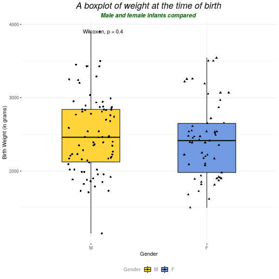
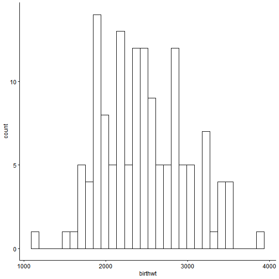
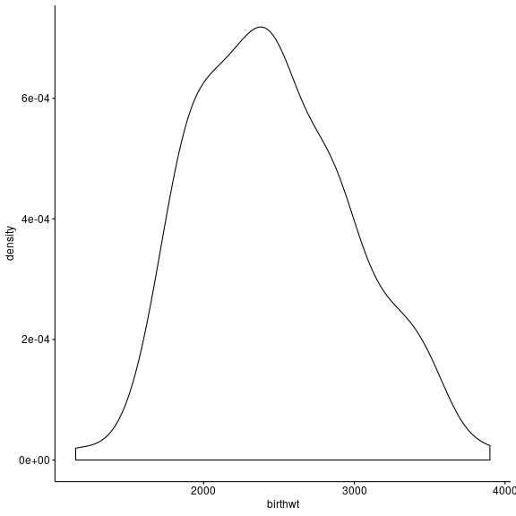
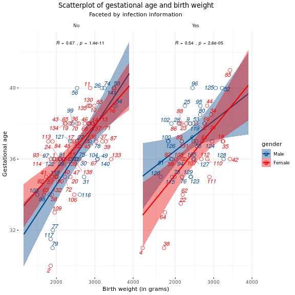

How to make plots in R using ggpubr
========================================================
author: Michail Belias  
date: 06-12-2018
autosize: true
class: small-code


Introduction
========================================================

The ggpubr is a R package that helps you create basic beautiful ggplot2-based graphs.

What is ggpubr:

 * Wrapper around the ggplot2 package for beginners in R programming.
 * Helps researchers, with basic R programming skills, to create easily publication-ready plots.
 * Gives the possibility to add p-values and significance levels to plots.
 * Makes it easy to arrange and annotate multiple plots on the same page.
 * Makes it easy to change grahical parameters such as colors and labels.
 * Is still a ggplot2 object... 
   * Therefore, it can be further manipulated as a ggplot object

Generate some data for descriptive statistics
========================================================


```r
library(haven)
bladder   <- read_sav("Data/bladder.sav")
surgery   <- read_sav("Data/surgery.sav")
skullrats <- read_sav("Data/SkullRats.sav")
```


Know thyself...and your data
========================================================


```r
names(bladder)
```

```
 [1] "Id"        "Birthday"  "gender"    "Date_diag" "Stage"    
 [6] "Grade"     "solitaire" "Nareas"    "Biopsy"    "Therapy"  
[11] "Recidive"  "Died"      "date_rec"  "date_ovl" 
```

```r
names(surgery)
```

```
[1] "id"       "gender"   "place"    "birthwt"  "gestatio" "lengthst"
[7] "infect"   "prematur" "surgery" 
```

Know thyself...and your data (part2)
========================================================

```r
names(skullrats)
```

```
[1] "obs"      "treat"    "rat"      "age"      "response" "t"       
```


Distribution plots
========================================================

Under this section we consider 

 * Boxplots
 * Violin + Boxplot
 * Dot + Box Plot
 * Histograms
 * Density Plots


Boxplot code 
========================================================


```r
gg<- ggboxplot(surgery , # the data-set
            x = "gender", 
            y = "birthwt", # variable to be plotted
            color = "black", # paint the borders by Gender
            fill = "gender", # fill the boxes with color
title = "Box-plot of birth-weight colored by gender", # a better title
            palette = "jco", # use the jco palette
            add = "mean", # or median
            bxp.errorbar = T  # adds the error bars of boxplots 
            ) +   
  theme(plot.title = element_text(hjust = 0.5))
```

Boxplot
========================================================


Histogram code 
========================================================


```r
gg<- gghistogram(surgery, 
            x= "birthwt" ,   # variable to be plotted
            y= "..count..", # or "..density.."
            color = "gender", # paint the borders by Gender
            fill = "gender", # fill the bars with color
            bins = 10 , # how many bars will the histogram have
title = "Histogram of birth-weight (by gender)", # a better title
            palette = "jco", # use the jco palette
            add = "mean", 
            add_density = T
            ) +   theme(plot.title = element_text(hjust = 0.5))
```

Histogram plot 
========================================================


Density plot code
========================================================


```r
gg <-  ggdensity(surgery, 
          x = "birthwt",
          fill = "gender",
          palette = "jco", 
          adjust = 3,
          title = "Density plot of weight", 
          linetype = "dotdash",color = "gender",add = "median" ) +   
  theme(plot.title = element_text(hjust = 0.5))+ facet_wrap(.~ gender, nrow = 2)
```

Density plot 
========================================================


```r
plot(gg)
```


Violin plot with boxplot code 
========================================================


```r
gg <-ggviolin(surgery ,
            x = "gender", y = "birthwt", # variable to be plotted
          combine = TRUE, title="Violin-plot with boxplot",
          color = "gender", palette = "jco",
          ylab = "Expression", 
          add = "boxplot")+   
  theme(plot.title = element_text(hjust = 0.5))
```

Violin plot with boxplot 
========================================================


2.Correlation plots 
========================================================

Under this section we consider 

 * Scatterplots
 * Jitter Plots
 * Counts Chart
 * Bubble Plot
 * Marginal Histograms / Boxplot


Scatterplots-Bubble plot code
========================================================

```r
gapminder = gapminder
# Scatterplot
names(gapminder) =  c("Country","Continent","Year","Life_Expectancy",
                      "Population","GDP_per_capita_percentage")

gg = gapminder%>%
    filter(Year %in% "2007")%>%
ggplot( aes(GDP_per_capita_percentage, Life_Expectancy,size = Population, 
            color = Continent)) + # This is then main plot 
  ggtitle("Life expectancy association with GDP per capita percentage (in 2007)")+
  # a new title
  theme(plot.title = element_text(hjust = 0.5))+
    geom_point() + # insert the points of the parameters used in the general ggplot
  xlab("GDP per capita") + # Change the label of X-axis
  ylab("Life Expectancy") # Change the label of Y-axis
```

Scatterplots Bubble plot 
========================================================


 
 
Scatter-plot code
========================================================


```r
# Scatterplot


g = ggscatter(surgery , # import data
              x = "birthwt",y = "gestatio", # x-y values
              color = "gender", palette = "jco",
              title = "Association of gestational age and birth weight (by gender)",
              xlab = "Birth weight (in kilograms)",
              ylab = "Gestational age", 
              shape = 1,
              ggtheme = theme_bw(),
              fill = "white"
              )
```

Scatter-plot
======================================================== 


Scatterplot with marginal histograms
======================================================== 


```r
ggMarginal(g, type = "histogram", fill="transparent")
```



Error plots
======================================================== 


```
   len supp dose
1  4.2   VC  0.5
2 11.5   VC  0.5
3  7.3   VC  0.5
4  5.8   VC  0.5
5  6.4   VC  0.5
6 10.0   VC  0.5
```


```r
# Change error plot type and add mean points
ggerrorplot(ToothGrowth, x = "dose", y = "len", 
            desc_stat = "mean_sd",
            error.plot = "errorbar",            # Change error plot type
            add = "mean"                        # Add mean points
            )
```



Ranking plots
========================================================

 * (Ordered) Bar Chart
 * Lollipop Chart
 * Dot Plot
 * Slope Chart
 * Dumbbell Plot


Bar Chart code
========================================================


```r
gg= ggbarplot(data = data1, #import  Data
          x="App",          # The X-value
          y="Proportion",   # The percentages
          fill="firebrick1",# The color of the bars
          xlab = "",        # label of X-axis
          title = "Bar chart of dating app percentage", # better title
          ylim = c(0,0.80), # Increase the ylimits
          ylab = "Share of respondents",
          order = c("Happn","Lexa","Paiq","Tinder","Badoo"))+   
  theme(plot.title = element_text(hjust = 0.5))+ 
  scale_y_continuous(breaks=seq(0,0.7,0.1),
                     labels=scales::percent)+
  geom_text(aes(label=paste(Proportion*100,"%",sep = "")),size=3,vjust=-1)
```

Bar Chart
========================================================




Ordered bar chart code
========================================================


```r
gg= data2%>%
  arrange(desc(-freq))%>%
  ggbarplot( #import  Data
          x="website",          # The X-value
          y="freq",   # The percentages
          fill="nature",# The color of the bars
          xlab = "",        # label of X-axis
          title = "Online dating services in Netherlands (June 2014)", # better title
          ylim = c(0,300000), # Increase the ylimits
          ylab = "Share of respondents")+ rotate() +
  scale_y_continuous(breaks=seq(0,300000,50000),expand=c(0,0))+
    theme(legend.position =c(0.85,0.25),
          legend.title=element_text(size=8),
          legend.text=element_text(size=8),
          plot.title = element_text(hjust = 0.5))
```

Ordered bar chart 
========================================================

```r
plot(gg)
```


Lollipop Chart code
========================================================


```r
# Plot
gg= ggplot(data2,aes(x=reorder(website,freq), 
                     y=freq, color=nature, 
                     fill = nature)) + 
  geom_point(size=5,shape = 1) + 
  geom_segment(aes(x=website, xend=website, y=0, yend=freq)) + 
  labs(title="Lollipop Chart", 
       subtitle="Online dating services in Netherlands (June 2014)", 
       caption="source: Alexa.com") + scale_color_lancet()+
  theme(axis.text.x = element_text(angle=65, vjust=0.6))+
  geom_text(aes(label= freq),size=2,hjust=-0.35) + rotate()
```


```r
plot(gg)
```


Line-point plots code
========================================================


```r
data4 <- read_excel("Data/Data for graphs.xlsx", sheet = "Sheet3")

## Exercise: Now code your plot to look like this:
gg <- ggplot(data=data4,aes(x=year,y=proportion,color=how))+
  geom_point()+geom_line()+theme_minimal()+xlab("Year Couple Met")+ylab("percentage who met this way")+
  scale_y_continuous(limits=c(0,0.7),breaks=seq(0,0.7,0.1),labels=scales::percent,expand=c(0,0))+
  scale_x_continuous(limits=c(1990,2014),breaks=seq(1990,2014,10),expand=c(0,0))+
  theme(legend.position = c(0.2,0.8))+geom_point(aes(shape=how))+scale_shape(guide=FALSE)+
  scale_color_discrete(name="",breaks=c("Met Online","Met through Friends","Bar/Restaurant"))+facet_wrap(~orientation)
```

Line-point plots
========================================================


```r
plot(gg)
```


