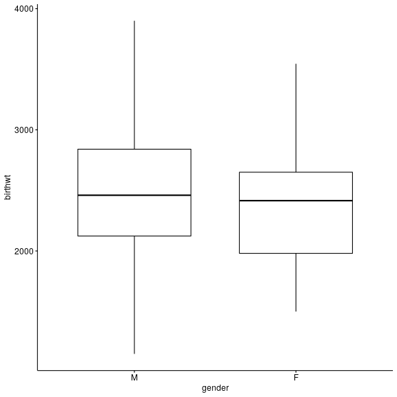
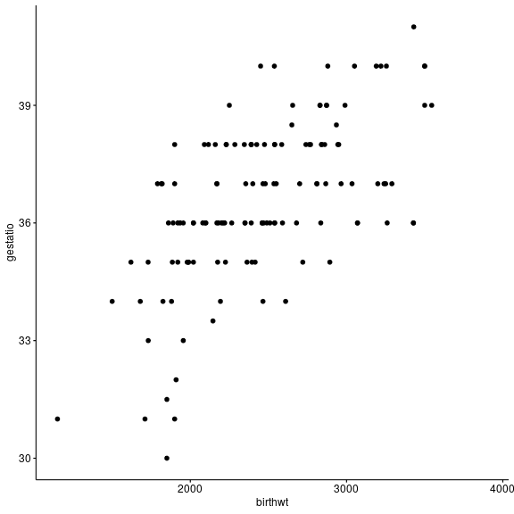
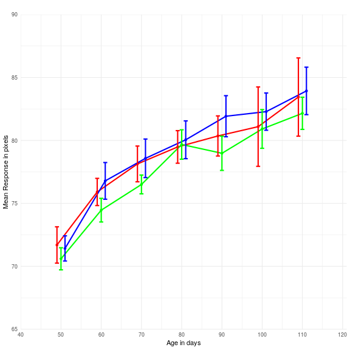
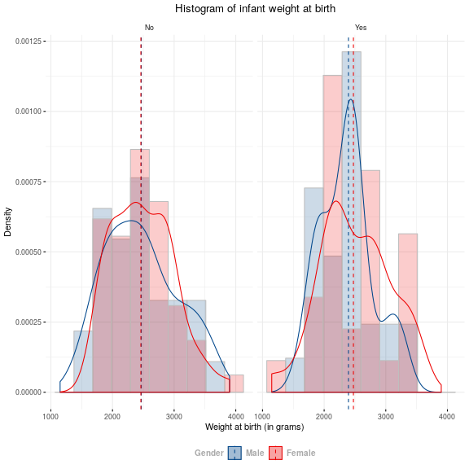
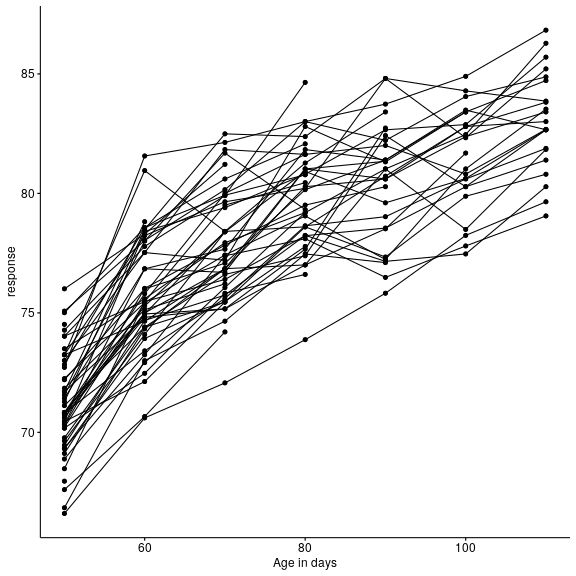

How to make plots in R using ggpubr
========================================================
author: Michail Belias  
date: 06-12-2018
autosize: true
class: small-code
width: 1980
height: 1200
autosize: true


Introduction
========================================================
- In R we can use either the base R plots (difficult and ugly) or go for ggplots.

- ggplot2 package has a steap learning curve, therefore
    * We will use ggpubr
    
- ggpubr is a R package that helps you create basic beautiful ggplot2-based graphs.
 * Helps researchers, to create easily publication-ready plots.
 * Provides the possibility to add p-values and significance levels to plots.
 * Makes it easy to arrange and annotate multiple plots on the same page.
 * Makes it easy to change grahical parameters such as colors and labels.
 * Produces  a ggplot2 object... 
   * Therefore, it can be further manipulated as a ggplot object


ggpubr package
========================================================

- ggpubr has more than 25 types of plots
- ggpubr has more than 60 functions to learn
- Therefore, it's impossible to learn them all **today**


What I want you to learn 
========================================================

- How to use the help file in Rstudio
  - ggpubr functions have great help file (use it)
- theme() , ggpar() are 2 important functions that provide ggplot2 flexibility 
- we can store a plot in an object using "<-" or "="
- Google is our friend
- We are also your friends... ask us


theme() function has everything you need to make your plot awesome ( go to the help file)
========================================================


```r
theme(line, rect, text, title, aspect.ratio, axis.title, axis.title.x,
  axis.title.x.top, axis.title.x.bottom, axis.title.y, axis.title.y.left,
  axis.title.y.right, axis.text, axis.text.x, axis.text.x.top,
  axis.text.x.bottom, axis.text.y, axis.text.y.left, axis.text.y.right,
  axis.ticks, axis.ticks.x, axis.ticks.x.top, axis.ticks.x.bottom, axis.ticks.y,
  axis.ticks.y.left, axis.ticks.y.right, axis.ticks.length, axis.line,
  axis.line.x, axis.line.x.top, axis.line.x.bottom, axis.line.y,
  axis.line.y.left, axis.line.y.right, legend.background, legend.margin,
  legend.spacing, legend.spacing.x, legend.spacing.y, legend.key,
  legend.key.size, legend.key.height, legend.key.width, legend.text,
  legend.text.align, legend.title, legend.title.align, legend.position,
  legend.direction, legend.justification, legend.box, legend.box.just,
  legend.box.margin, legend.box.background, legend.box.spacing,
  panel.background, panel.border, panel.spacing, panel.spacing.x,
  panel.spacing.y, panel.grid, panel.grid.major, panel.grid.minor,
  panel.grid.major.x, panel.grid.major.y, panel.grid.minor.x,
  panel.grid.minor.y, panel.ontop, plot.background, plot.title, plot.subtitle,
  plot.caption, plot.tag, plot.tag.position, plot.margin, strip.background,
  strip.background.x, strip.background.y, strip.placement, strip.text,
  strip.text.x, strip.text.y, strip.switch.pad.grid, strip.switch.pad.wrap, ...,
  complete = FALSE, validate = TRUE)
```


A note for the gg functions we will use
========================================================

- Sometimes in their help fill at end of the options you will see three dots "..."
- This implies that the function has more options 
- The options of a function like theme above can be used in our gg function


By the end of the day we will go from this
========================================================




And this
========================================================




To this
========================================================


This
========================================================


And this 
========================================================





Install and load the packages we will use
========================================================

- You can do it manually through the "install" dialog in the "packages" tab 
- Install the following packages
  - haven, readxl, gapminder, ggplot2, ggExtra, ggsci, dplyr,  ggpubr, ggkm


Load the data
========================================================

- We can either use the command line or load them manually
- Use the "Import Dataset" dialog in the Enviroment Tab
- or the following commands


```r
library(haven)
bladder   <- read_sav("Data/bladder.sav")
surgery   <- read_sav("Data/surgery.sav")
skullrats <- read_sav("Data/SkullRats.sav")
```


Know your data
========================================================

- Feel free to use your own data in our lab
- with the following commands we can get in touch with our data
  * summary("dataname"), names("dataname"), head("dataname"), view("dataset")
- Use the help tab in your right to see what the functions do (and their options)
- Please play around with the data


Distribution plots
========================================================

Under this section we will show how to plot 

 * Boxplots...........(with ggboxplot) 
 * Histograms.........(with gghistogram)
 * Density Plots......(with ggdensity)

For every function above there is a full description in their help file.
Go to the tab "Help" and write the function in the search box

Boxplot code 
========================================================

First we will see a simple box-plot


```r
gg<- ggboxplot(surgery ,  # the data-set
            x = "gender", # the x-values is the categorical variable
            y = "birthwt" # the y-values is their values 
            )
```

Simple boxplot
========================================================


Full boxplot code 
========================================================

- Search the help file of ggboxplot
- *Tip:* If you select any function and press F1 you go to the function's help file right away


```r
ggboxplot(data, x, y, # load the data and choose the x and y variables
  combine = FALSE, merge = FALSE, color = "black", 
  fill = "white", palette = NULL, title = NULL, xlab = NULL,
  ylab = NULL, bxp.errorbar = FALSE, bxp.errorbar.width = 0.4,
  facet.by = NULL, panel.labs = NULL, short.panel.labs = TRUE,
  linetype = "solid", size = NULL, width = 0.7, notch = FALSE,
  select = NULL, remove = NULL, order = NULL, add = "none",
  add.params = list(), error.plot = "pointrange", label = NULL,
  font.label = list(size = 11, color = "black"), label.select = NULL,
  repel = FALSE, label.rectangle = FALSE, ggtheme = theme_pubr())
```

Sophisticated boxplot example code 
========================================================


```r
gg <- ggboxplot(data = surgery,x =  "gender", y = "birthwt",
          xlab = "Gender", ylab = "Birth Weight (in grams)",
          width = 0.5,add = "jitter", 
          shape = "gender",fill = "gender",palette = "simpsons",
          title = "A boxplot of weight at the time of birth",
          legend = "bottom",legend.title="Gender",font.legend = c(10, "bold", "darkgrey"),  
          font.main = c(18, "italic", "black"),
          subtitle = "Male and female infants compared ", font.subtitle = c(12, "bold.italic", "darkgreen"),
          ggtheme = theme_minimal()
) +   
  theme(plot.title = element_text(hjust = 0.5),
        plot.subtitle = element_text(hjust = 0.5)) + 
  stat_compare_means(method = "wilcox.test")#  Add a p-value
```

Sophisticated boxplot example
========================================================


How did we get there?
========================================================


- open ggboxplot.R code 


Simple histogram code 
========================================================


```r
# Basic histogram plot
gghistogram(surgery, x = "birthwt")
```


Sophisticated histogram example code 
========================================================


```r
gg<- gghistogram(surgery, x = "birthwt",y = "..density..",add = "median",
            bins = 10 , # how many bars will the histogram have
            xlab = "Weight at birth (in grams)", ylab = "Density",
            title = "Histogram of infant weight at birth",
            fill = "gender",color = "grey",palette = "lancet",
            alpha = 0.2,legend = "bottom",legend.title="Gender",
            font.legend = c(10, "bold", "darkgrey"), facet.by = "infect", ggtheme = theme_minimal(), add_density = T )+   
  theme(plot.title = element_text(hjust = 0.5),
        plot.subtitle = element_text(hjust = 0.5))
```

Sophisticated histogram plot 
========================================================



Simple Density plot code 
========================================================

```r
# Basic Density plot 
ggdensity(surgery, x = "birthwt")
```


Sophisticated density plot code
========================================================


```r
gg <-  ggdensity(surgery, x = "birthwt",add = "median",
            xlab = "Weight at birth (in grams)", ylab = "Frequency",
            title = "Density plot of infant weight at birth",
            fill = "gender",color = "grey",palette = "lancet",
            alpha = 0.2,legend = "bottom",legend.title="Gender",
            font.legend = c(10, "bold", "darkgrey"), facet.by = "infect", ggtheme = theme_minimal() )+   
  theme(plot.title = element_text(hjust = 0.5),
        plot.subtitle = element_text(hjust = 0.5))
```

Sophisticated density plot 
========================================================


```r
plot(gg)
```


Scatterplots
========================================================

What we learned so far?

1) How to use the help file of the gg"function"
2) All the gg functions:
  - are compatible with ggpar() function options
  - produce ggplot2 objects
  - which we can further manipulate using ggplot2 functions
    - such as theme() , facet_grid() etc


Scatter-plot
========================================================

Exercise 1:
Can we make this plot?


Remember
========================================================

We know we want to plot a scatterplot.
We use the surgery data


- ggscatter() is the function
- go the help file
- start filling the options


Simple point-line plot
======================================================== 



Sophisticated spaggetti plot code
======================================================== 


```r
gg<- ggline(skullrats, y= "response", x = "age", add = "point",numeric.x.axis = T, 
      group= "rat",ylab = "Mean Response in pixels",xlab = "Age in days" , title = "Treatment",
      facet.by = "treat",
      legend.title = element_text(size=8),legend.text=element_text(size=7))+
  theme(plot.title = element_text(hjust=0.5,size = 10),
        legend.title = element_text(size=8),legend.text=element_text(size=7))
```

Sophisticated spaggetti plot
======================================================== 

plot(gg)

Spaggetti plots with dplyr manipulation
======================================================== 


```r
skullrats%>%
    mutate(treat = factor(treat, levels = c("Control", "Low dose", "High dose")))%>%
  arrange(treat)%>%
ggline( y= "response", x = "age", add = "point",numeric.x.axis = T,
      group= "rat",ylab = "Mean Response in pixels",xlab = "Age in days" , title = "Treatment",
      facet.by = "treat",
      legend.title = element_text(size=8),legend.text=element_text(size=7))+
  theme(plot.title = element_text(hjust=0.5,size = 10),
        legend.title = element_text(size=8),legend.text=element_text(size=7))
```


Errorplot 
========================================================


Bar plots code
========================================================


```r
gg= ggbarplot(data = data1, #import  Data
          x="App",          # The X-value
          y="Proportion",   # The percentages
          fill="firebrick1",# The color of the bars
          xlab = "",        # label of X-axis
          title = "Bar chart of dating app percentage", # better title
          ylim = c(0,0.80), # Increase the ylimits
          ylab = "Share of respondents",
          order = c("Happn","Lexa","Paiq","Tinder","Badoo"))+   
  theme(plot.title = element_text(hjust = 0.5))+ 
  scale_y_continuous(breaks=seq(0,0.7,0.1),
                     labels=scales::percent)+
  geom_text(aes(label=paste(Proportion*100,"%",sep = "")),size=3,vjust=-1)
```

Bar plot
========================================================


Ordered bar plot code
========================================================


```r
gg= data2%>%
  arrange(desc(-freq))%>%
  ggbarplot( #import  Data
          x="website",          # The X-value
          y="freq",   # The percentages
          fill="nature",# The color of the bars
          xlab = "",        # label of X-axis
          title = "Online dating services in Netherlands (June 2014)", # better title
          ylim = c(0,300000), # Increase the ylimits
          ylab = "Share of respondents")+ rotate() +
  scale_y_continuous(breaks=seq(0,300000,50000),expand=c(0,0))+
    theme(legend.position =c(0.85,0.25),
          legend.title=element_text(size=8),
          legend.text=element_text(size=8),
          plot.title = element_text(hjust = 0.5))
```

Ordered bar plot 
========================================================

```r
plot(gg)
```


```

  |                                                                       
  |                                                                 |   0%
  |                                                                       
  |.                                                                |   1%
  |                                                                       
  |..                                                               |   3%
  |                                                                       
  |...                                                              |   4%
  |                                                                       
  |....                                                             |   6%
  |                                                                       
  |.....                                                            |   7%
  |                                                                       
  |......                                                           |   9%
  |                                                                       
  |.......                                                          |  10%
  |                                                                       
  |........                                                         |  12%
  |                                                                       
  |.........                                                        |  13%
  |                                                                       
  |..........                                                       |  15%
  |                                                                       
  |...........                                                      |  16%
  |                                                                       
  |............                                                     |  18%
  |                                                                       
  |.............                                                    |  19%
  |                                                                       
  |..............                                                   |  21%
  |                                                                       
  |...............                                                  |  22%
  |                                                                       
  |................                                                 |  24%
  |                                                                       
  |................                                                 |  25%
  |                                                                       
  |.................                                                |  27%
  |                                                                       
  |..................                                               |  28%
  |                                                                       
  |...................                                              |  30%
  |                                                                       
  |....................                                             |  31%
  |                                                                       
  |.....................                                            |  33%
  |                                                                       
  |......................                                           |  34%
  |                                                                       
  |.......................                                          |  36%
  |                                                                       
  |........................                                         |  37%
  |                                                                       
  |.........................                                        |  39%
  |                                                                       
  |..........................                                       |  40%
  |                                                                       
  |...........................                                      |  42%
  |                                                                       
  |............................                                     |  43%
  |                                                                       
  |.............................                                    |  45%
  |                                                                       
  |..............................                                   |  46%
  |                                                                       
  |...............................                                  |  48%
  |                                                                       
  |................................                                 |  49%
  |                                                                       
  |.................................                                |  51%
  |                                                                       
  |..................................                               |  52%
  |                                                                       
  |...................................                              |  54%
  |                                                                       
  |....................................                             |  55%
  |                                                                       
  |.....................................                            |  57%
  |                                                                       
  |......................................                           |  58%
  |                                                                       
  |.......................................                          |  60%
  |                                                                       
  |........................................                         |  61%
  |                                                                       
  |.........................................                        |  63%
  |                                                                       
  |..........................................                       |  64%
  |                                                                       
  |...........................................                      |  66%
  |                                                                       
  |............................................                     |  67%
  |                                                                       
  |.............................................                    |  69%
  |                                                                       
  |..............................................                   |  70%
  |                                                                       
  |...............................................                  |  72%
  |                                                                       
  |................................................                 |  73%
  |                                                                       
  |.................................................                |  75%
  |                                                                       
  |.................................................                |  76%
  |                                                                       
  |..................................................               |  78%
  |                                                                       
  |...................................................              |  79%
  |                                                                       
  |....................................................             |  81%
  |                                                                       
  |.....................................................            |  82%
  |                                                                       
  |......................................................           |  84%
  |                                                                       
  |.......................................................          |  85%
  |                                                                       
  |........................................................         |  87%
  |                                                                       
  |.........................................................        |  88%
  |                                                                       
  |..........................................................       |  90%
  |                                                                       
  |...........................................................      |  91%
  |                                                                       
  |............................................................     |  93%
  |                                                                       
  |.............................................................    |  94%
  |                                                                       
  |..............................................................   |  96%
  |                                                                       
  |...............................................................  |  97%
  |                                                                       
  |................................................................ |  99%
  |                                                                       
  |.................................................................| 100%
```

```
[1] "presentation.R"
```

